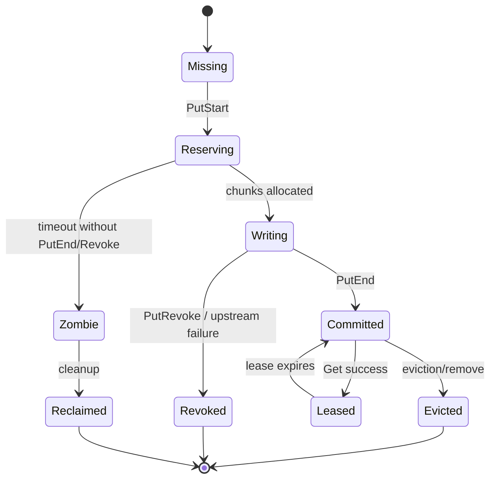

# Distributed API Response KVCache PRD and Design

> **Status:** Approved direction from interactive design session on 2026-07-03.  
> **Scope:** Product requirements and architecture design only. No implementation code is included in this document.  
> **Core correction:** In this product, “KVCache” means a distributed key-value object cache for OpenAI Responses API results, not raw transformer KV tensors. Vendor APIs do not expose prefill/decode internals or layer KV tensor state.

## 1. Product Summary

Build a distributed, low-latency cache gateway for large-scale parallel access to vendor LLM APIs.

Users call an OpenAI-compatible Responses API endpoint exposed by this system. The gateway first checks a distributed cache. On a strict exact cache hit, it returns a cached response immediately. On a miss, it calls the configured vendor API, streams or returns the vendor response to the caller, captures the complete successful response, and writes it back into the distributed cache.

The architecture is a Mooncake-style trimmed design:

- Keep Mooncake’s separation of metadata control plane and object data plane.
- Keep Master/Store roles, object lifecycle, lease safety, segment allocation, replication, pinning, eviction, DRAM+SSD hierarchy, and HA metadata coordination.
- Remove prefill/decode scheduling, GPU memory, raw model KV tensors, RDMA/TransferEngine dependency for the first version, and any model-runtime assumptions.

## 2. Goals

1. Provide a distributed cache-fronting API for OpenAI Responses-compatible LLM requests.
2. Serve exact repeated deterministic requests from cache with low latency.
3. Reduce vendor API calls, cost, and tail latency under repeated or bursty workloads.
4. Support large-scale parallel access through Gateway horizontal scaling, Store node horizontal scaling, and Master HA.
5. Store hot data in DRAM and colder cache objects on SSD.
6. Support both streaming and non-streaming Responses API calls.
7. Coalesce concurrent identical misses so one vendor call can satisfy many waiters.
8. Provide a full operations control panel for health, capacity, tenants, cache objects, vendors, policies, alerts, and administrative actions.

## 3. Non-Goals

1. No raw transformer KV tensor storage in the first version.
2. No prefill/decode ownership, scheduling, or optimization.
3. No GPU memory management.
4. No RDMA or Mooncake Transfer Engine dependency in the first version.
5. No semantic-similarity cache hits.
6. No prefix reuse for partially matching prompts.
7. No multi-region active-active consistency in the first version.
8. No caching of incomplete, failed, interrupted, or unsafe vendor responses.
9. No transparent claim that this reproduces Mooncake’s model-internal KV reuse; it is a Mooncake-inspired distributed API response cache.

## 4. Confirmed Product Decisions

| Area | Decision |
| --- | --- |
| Cache primitive | API response object cache |
| Public API | OpenAI Responses API compatible |
| Implementation stack | Rust backend; React + TypeScript + Vite control panel |
| Deployment scope | Single Region / single cluster |
| Hit policy | Strict exact match |
| Cache key | Tenant + vendor + model + endpoint/schema/adapter versions + canonical full request body + cache-relevant headers/policy |
| Automatic eligibility | Deterministic requests only by default |
| Random requests | Bypass unless explicitly opted into exact replay |
| Streaming | Supported on miss and hit |
| Streaming storage | Store original SSE event sequence and final aggregated response object |
| Miss coalescing | Enable singleflight for identical tenant + fingerprint misses |
| Writeback | Only complete successful vendor responses are committed |
| DRAM/SSD | DRAM hot cache + SSD cold cache; SSD hit promotes back to DRAM |
| Metadata HA | etcd + multiple Master replicas with one leader |
| Tenant model | Strong multi-tenant isolation |
| Error posture | Cache failure defaults to fail-open vendor fallback except explicit cache-only, auth, quota, and idempotency conflicts |
| Eviction | Mooncake-style watermarked approximate LRU with lease and pin protection |
| Replication | Normal objects start with one DRAM replica; hot objects scale to 2–3 replicas |
| Security | Production-grade default security |
| Control panel | Full operations management console with RBAC and audit |

## 5. Primary User Flows

### 5.1 Non-Streaming Cache Hit

1. Client calls `POST /v1/responses` with `stream=false` or no streaming flag.
2. Gateway authenticates tenant and rate limits the request.
3. Gateway canonicalizes the complete request and cache-relevant headers.
4. Gateway computes the strict cache fingerprint.
5. Gateway asks Master for committed replicas of the object.
6. Master returns a lease and one or more readable replica locations.
7. Gateway reads the aggregated response JSON from a Store node.
8. Gateway returns the cached JSON with cache decision headers.

### 5.2 Non-Streaming Cache Miss

1. Gateway computes the fingerprint.
2. Gateway checks idempotency and singleflight state.
3. If no leader request exists for the same fingerprint, this request becomes the singleflight leader.
4. Gateway calls the configured vendor adapter.
5. Gateway returns the vendor response to the caller.
6. If the response is complete and cache-eligible, Gateway starts writeback:
   - `PutStart` reserves object chunks.
   - Gateway writes the object bytes to Store nodes.
   - Gateway calls `PutEnd` to make the object visible.
7. Waiters for the same fingerprint receive the same final result.

### 5.3 Streaming Cache Hit

1. Client calls `POST /v1/responses` with streaming enabled.
2. Gateway computes the fingerprint and finds a committed cache object.
3. Gateway reads the stored SSE event sequence.
4. Gateway replays events using the OpenAI Responses-compatible SSE schema.
5. Gateway may replay faster than the original vendor stream, but must preserve event order, event types, final usage metadata, and terminal event semantics.

### 5.4 Streaming Cache Miss

1. Gateway becomes singleflight leader or joins an existing in-flight stream for the same fingerprint.
2. Leader calls vendor adapter and streams events to the caller.
3. Gateway captures raw Responses SSE events and incrementally builds the final aggregated response object.
4. If the stream completes successfully, Gateway commits both artifacts:
   - original SSE event sequence for future streaming hits;
   - final aggregated JSON object for future non-streaming hits.
5. If the stream fails, disconnects, is canceled before completion, or violates eligibility rules, Gateway calls `PutRevoke` or skips `PutStart` entirely. No cache object becomes visible.

## 6. System Architecture

```mermaid
flowchart LR
  Client[Client SDK / App] --> Gateway[API Gateway Cluster]
  Gateway -->|metadata RPC| Master[Master Leader]
  Master <--> Etcd[(etcd)]
  Master --> Masters[Standby Masters]
  Gateway -->|read/write object chunks| StoreA[Store Node A\nDRAM + SSD]
  Gateway -->|read/write object chunks| StoreB[Store Node B\nDRAM + SSD]
  Gateway -->|miss| Vendor[Vendor API]
  Control[Operations Console] --> AdminAPI[Admin API]
  AdminAPI --> Master
  AdminAPI --> Gateway
  AdminAPI --> StoreA
  AdminAPI --> StoreB
  Metrics[(Prometheus / Logs / Traces)] <-- Gateway
  Metrics <-- Master
  Metrics <-- StoreA
  Metrics <-- StoreB
```

### 6.1 API Gateway

Responsibilities:

- expose OpenAI Responses-compatible public API;
- authenticate tenants and enforce tenant-level rate limits;
- canonicalize requests and compute fingerprints;
- enforce cache eligibility;
- handle `Idempotency-Key`;
- execute singleflight miss coalescing;
- read cache objects from Store nodes;
- call vendor adapters on miss;
- stream through vendor responses while capturing cacheable artifacts;
- initiate cache writeback using Master allocation metadata;
- emit cache decision headers, logs, metrics, and traces.

The Gateway is stateless except for short-lived in-flight singleflight coordination. Durable cache object state belongs to Master metadata and Store nodes.

### 6.2 Master Control Plane

Responsibilities:

- maintain tenant-scoped object metadata;
- track Store node membership and segment capacity;
- allocate DRAM/SSD chunks for cache objects;
- maintain replica locations and object status;
- issue and refresh read leases;
- enforce tenant DRAM/SSD quotas;
- trigger eviction;
- manage soft pin and hard pin state;
- handle node drain and node failure metadata updates;
- expose administrative APIs;
- persist HA state through etcd.

The Master never proxies cached response bytes. It controls where bytes live, whether they are visible, and when they can be deleted.

### 6.3 Store Node

Responsibilities:

- own one or more DRAM segments;
- own one local SSD cache directory or device;
- serve object chunk reads and writes;
- write new cache objects to DRAM first;
- persist eligible objects asynchronously to SSD cold tier;
- promote SSD hits into DRAM when capacity allows;
- report heartbeat, capacity, pressure, and disk metrics to Master;
- reject unauthorized direct access without a valid Gateway/Master-issued read or write token.

Store nodes do not decide global placement, lifecycle visibility, or tenant quota. Those decisions stay in Master.

### 6.4 Vendor Adapter Layer

Define a Rust `VendorAdapter` trait with these responsibilities:

- translate the canonical Responses request to the vendor-specific request;
- expose vendor/model identity and resolved model version;
- classify deterministic-safe requests;
- execute non-streaming calls;
- execute streaming calls and parse SSE/event formats;
- classify retryable errors;
- enforce per-vendor timeout and retry policy;
- expose usage and cost metadata when available.

First-version policy:

- use conservative retries for connection errors, selected 5xx errors, and vendor rate-limit responses;
- do not automatically retry after streaming bytes have already been sent to the client;
- do not cache failed responses;
- route by tenant policy and requested model.

### 6.5 Control Panel

The control panel is a React + TypeScript + Vite web application backed by Rust Admin APIs.

It is an operations console, not a tenant self-service portal in the first version. It is full-featured enough for production operations.

RBAC roles:

| Role | Permissions |
| --- | --- |
| Viewer | Read health, metrics, cache stats, node status, audit logs, tenant summaries |
| Operator | Viewer permissions plus node drain, manual warmup, cache remove, alert acknowledge |
| Admin | Operator permissions plus tenant policy changes, vendor config changes, quota changes, RBAC user management |

All write operations require audit logging with actor, role, tenant scope, resource, before/after summary, request ID, and result.

Control panel pages:

1. **Overview**
   - global health;
   - request rate;
   - cache hit rate;
   - vendor calls avoided;
   - estimated cost saved;
   - p50/p95/p99 hit latency;
   - p50/p95/p99 miss overhead;
   - active alerts.

2. **Cache Analytics**
   - hit/miss/bypass/ineligible/writeback-failed breakdown;
   - top hot keys by hashed fingerprint;
   - top tenants by storage and traffic;
   - DRAM vs SSD hit ratio;
   - eviction reasons;
   - singleflight leaders and waiters.

3. **Node and Segment Management**
   - Store node list;
   - DRAM capacity and pressure;
   - SSD capacity and pressure;
   - segment status;
   - replica counts;
   - heartbeat age;
   - drain/undrain action;
   - node failure and recovery status.

4. **Tenant Quota and Policy**
   - tenant list;
   - API keys or key references;
   - DRAM quota;
   - SSD quota;
   - request rate limits;
   - concurrent streaming limit;
   - miss/vendor spend budget;
   - default TTL;
   - cache eligibility overrides;
   - cache-only permissions.

5. **Vendor/API Management**
   - vendor adapter health;
   - configured models;
   - resolved model version IDs;
   - rate-limit status;
   - error rate;
   - retry counts;
   - cost metadata;
   - routing policy.

6. **Cache Operations**
   - debug fingerprint for a pasted request;
   - query cache object by tenant + key/fingerprint;
   - remove cache object by key;
   - remove by tenant/model/prefix;
   - manual warmup with a request payload;
   - pin/unpin where allowed by policy;
   - inspect object metadata without exposing sensitive payload by default.

7. **Alerting**
   - active alerts;
   - alert history;
   - acknowledge/silence actions;
   - threshold configuration for Admins.

8. **Audit Log**
   - write action history;
   - security-sensitive read events;
   - filter by actor, tenant, action, resource, and result.

Accessibility requirements:

- meet WCAG 2.2 AA for the control panel;
- keyboard-accessible navigation and tables;
- visible focus indicators;
- no color-only status indicators;
- icon-only buttons require accessible labels;
- destructive modals trap focus and support Escape/cancel;
- tables expose semantic headers and sortable column state.

## 7. Cache Key and Fingerprint

The cache key is a SHA-256 hash over a canonical fingerprint document.

Fingerprint fields:

- tenant ID;
- public endpoint name and version;
- API schema version;
- vendor ID;
- resolved vendor model ID;
- adapter version;
- full canonical request body;
- cache-relevant headers;
- cache policy mode;
- deterministic eligibility fields;
- tool definitions and tool-choice fields if present in the Responses request;
- response format fields if present.

Canonicalization rules:

- parse JSON into a canonical representation;
- sort object keys recursively;
- preserve array order;
- preserve numeric values exactly according to JSON parse semantics used by the API layer;
- remove transport-only headers that cannot affect generation;
- include all fields that may affect vendor output;
- reject ambiguous or invalid JSON before cache lookup.

Strict policy:

- No semantic similarity.
- No prefix matching.
- No partial prompt reuse.
- No caller-provided raw key as the sole source of truth.

The control panel may expose a debug endpoint that shows a redacted fingerprint document and hash for an authorized operator.

## 8. Cache Eligibility

Default automatic caching applies only when the request is deterministic-safe.

A request is deterministic-safe when:

- model/vendor adapter classifies it as stable;
- stochastic parameters are deterministic equivalents, such as `temperature=0` where supported;
- no request field asks for non-replayable behavior;
- the request is not marked `X-Cache-Control: bypass`;
- tenant policy allows writeback;
- object size is below configured limits;
- response completes successfully.

Random or stochastic requests default to bypass. A tenant may explicitly opt into exact replay with a cache-control header if product policy allows it. In that mode, the system still uses strict exact match and returns the same cached response for the same fingerprint.

## 9. Public API Controls

The body remains OpenAI Responses API compatible. Cache controls use a small set of headers so the request body can pass through to vendor adapters cleanly.

Request headers:

| Header | Meaning |
| --- | --- |
| `Authorization` | Tenant authentication |
| `Idempotency-Key` | Retry safety for a request fingerprint |
| `X-Cache-Control` | `default`, `bypass`, `read-only`, `write-only`, `cache-only`, `force-replay` |
| `X-Cache-TTL` | Optional requested TTL, bounded by tenant policy |
| `X-Cache-Key-Debug` | If authorized, include debug key metadata in response headers/logs |

Response headers:

| Header | Meaning |
| --- | --- |
| `X-Cache-Status` | `hit`, `miss`, `bypass`, `ineligible`, `cache-only-miss`, `degraded` |
| `X-Cache-Key` | Redacted or hashed cache key, only when policy allows |
| `X-Cache-Write` | `committed`, `skipped`, `failed`, `revoked`, `pending` |
| `X-Cache-Coalesced` | `leader`, `waiter`, or `none` |
| `X-Cache-Tier` | `dram`, `ssd`, `vendor`, or `none` |
| `X-Request-Id` | Gateway request ID |

Error behavior:

- cache subsystem failure defaults to vendor fallback with `X-Cache-Status: degraded`;
- `cache-only` with no hit returns a cache miss error without calling vendor;
- authentication failure returns 401;
- tenant quota/rate-limit failure returns 429 or 403 depending on policy;
- `Idempotency-Key` reused with a different fingerprint returns 409;
- invalid cache-control headers return 400.

## 10. Object Lifecycle and Consistency

Objects are immutable once committed.

Lifecycle states:



Consistency rules:

1. `Get` can only return committed objects.
2. `PutStart` reserves space but does not expose the object.
3. `PutEnd` atomically marks the object visible in Master metadata.
4. `PutRevoke` releases or marks reserved chunks unavailable.
5. Reads receive leases from Master.
6. Eviction and remove skip active leases.
7. If a read lease expires before a read completes, the Gateway retries from another replica or falls back according to request policy.
8. A zombie write is cleaned by timeout and cannot block a key forever.
9. The same tenant + fingerprint maps to one visible committed object version at a time.
10. Model/vendor/adapter version changes create different fingerprints rather than mutating existing cache objects.

## 11. Singleflight Miss Coalescing

Singleflight key:

- tenant ID;
- cache fingerprint;
- stream mode compatibility;
- cache-control mode.

Behavior:

1. First cache-eligible miss becomes leader.
2. Later identical misses join as waiters.
3. Non-streaming waiters receive the leader result after completion.
4. Streaming waiters may subscribe to the leader’s event fanout when they arrive before stream completion.
5. Waiters joining after stream completion read the newly committed cache object.
6. If leader fails, waiters receive the same failure unless policy allows a new leader retry.
7. Singleflight entries have bounded lifetime and waiter count to avoid memory pressure.

## 12. DRAM and SSD Storage

### 12.1 Object Layout

Each cached response object stores:

- metadata envelope;
- final aggregated response JSON;
- raw SSE event sequence when streaming was used or when replay support is required;
- usage/cost metadata;
- checksum;
- creation time;
- TTL expiration time;
- tenant/model/vendor identity;
- version fields.

Large objects are split into fixed-size chunks. Default chunk size: 1 MiB. Maximum first-version object size target: 10 MiB before compression. Requests producing larger objects are cache-ineligible unless tenant policy explicitly raises the limit.

### 12.2 DRAM Hot Tier

- write new objects to DRAM first;
- serve hits from DRAM whenever possible;
- track approximate LRU access time;
- protect active leases and incomplete writes;
- use soft pin for hot objects;
- use hard pin only for operator-approved critical objects.

### 12.3 SSD Cold Tier

- asynchronously persist committed eligible objects from DRAM to SSD;
- keep SSD copy when DRAM copy is evicted;
- on SSD hit, read from SSD and promote to DRAM if quota and watermarks allow;
- SSD object files are encrypted at rest;
- SSD has independent capacity watermarks and eviction.

### 12.4 Watermarks

Default production watermarks:

| Tier | High watermark | Target after eviction | Emergency watermark |
| --- | ---: | ---: | ---: |
| DRAM | 90% | 80% | 95% |
| SSD | 90% | 85% | 97% |

Eviction policy:

- approximate LRU within tenant quota scope;
- skip active leases;
- skip incomplete writes;
- skip hard-pinned objects;
- deprioritize soft-pinned objects;
- consider object size, age, and access count;
- preserve SSD copies when evicting DRAM objects;
- delete from SSD only under SSD pressure or explicit remove.

## 13. Replication and Hotspot Handling

Default:

- ordinary DRAM objects have one replica;
- SSD cold copy is used for capacity and recovery, not counted as low-latency DRAM replica;
- hot objects may be asynchronously replicated to 2–3 DRAM replicas.

Hot object detection signals:

- high hit QPS;
- high concurrent readers;
- repeated singleflight waiters;
- high tenant priority;
- operator pin or manual warmup.

Placement policy:

- spread replicas across distinct Store nodes;
- prefer nodes with lower DRAM pressure;
- avoid draining or unhealthy nodes;
- keep tenant quota enforcement strict;
- avoid colocating all hot replicas in one failure domain when failure-domain labels exist.

## 14. Tenant Isolation, Quota, and Rate Limits

Tenant isolation:

- each API key maps to one tenant;
- cache keys are tenant-scoped;
- object metadata is tenant-scoped;
- quotas are tenant-scoped;
- admin actions require tenant scope unless global Admin role is used.

Tenant quotas:

- DRAM bytes;
- SSD bytes;
- object count;
- max object size;
- default TTL and max TTL;
- concurrent streaming requests;
- request QPS;
- miss/vendor-call QPS;
- miss spend budget.

Quota behavior:

- reads are allowed while under read limits;
- writes require quota reservation before `PutStart`;
- if tenant DRAM quota is full, tenant-scoped eviction is attempted;
- if quota still fails, writeback is skipped while the user request can still succeed from vendor;
- if tenant miss budget is exhausted, request fails or cache-only behavior applies according to tenant policy.

## 15. Security and Privacy

Production default security:

- TLS for public API;
- mTLS or authenticated service mesh between Gateway, Master, Store, and Admin API;
- tenant namespace isolation in metadata and storage;
- SSD encryption at rest;
- no plaintext sensitive headers in cache key debug output;
- redaction in logs and control panel by default;
- request payloads visible in control panel only with explicit privileged action and audit;
- per-tenant deletion by key, model, prefix, or full tenant purge;
- cache bypass header for sensitive requests;
- signed internal read/write tokens for Store node data operations;
- all administrative write actions audited.

## 16. Model Versioning and Invalidation

Fingerprint includes:

- vendor ID;
- requested model name;
- resolved model version ID when available;
- adapter version;
- response schema version.

Invalidation supports:

- remove by exact key;
- remove by tenant;
- remove by tenant + model;
- remove by prefix or fingerprint prefix where safe;
- remove by adapter/schema version;
- TTL natural expiration;
- manual purge from control panel;
- admin API purge with audit.

If a vendor silently changes a model without a version ID, the adapter must expose a configured model revision string. Operators update the revision to force new fingerprints.

## 17. Observability and Alerts

### 17.1 Metrics

Gateway metrics:

- request rate by tenant/model/vendor;
- hit/miss/bypass/ineligible/degraded rates;
- hit latency p50/p95/p99;
- miss overhead p50/p95/p99 excluding vendor generation time;
- TTFT for streaming hits and misses;
- singleflight leader/waiter counts;
- vendor calls avoided;
- estimated tokens and cost saved;
- idempotency replays and conflicts;
- vendor error and retry counts.

Master metrics:

- object count;
- committed/reserving/writing/zombie counts;
- metadata RPC latency;
- lease grants and expirations;
- eviction attempts and reclaimed bytes;
- tenant quota usage;
- allocation failures;
- leader election changes;
- etcd latency and errors.

Store metrics:

- DRAM used/free bytes;
- SSD used/free bytes;
- read/write throughput;
- chunk read/write latency;
- SSD promotion count;
- checksum failures;
- heartbeat age;
- node drain status;
- replica count distribution.

Control panel metrics:

- login success/failure;
- admin write actions;
- audit log write failures;
- RBAC denials.

### 17.2 Alerts

Default alerts:

- Gateway 5xx rate above threshold;
- cache degraded rate above threshold;
- hit latency p95 above 50 ms target;
- miss overhead p95 above 30 ms target;
- Master leader unavailable;
- etcd quorum unhealthy;
- Store node heartbeat stale;
- DRAM emergency watermark reached;
- SSD emergency watermark reached;
- writeback failure rate elevated;
- eviction unable to reclaim target bytes;
- tenant quota exhaustion;
- vendor error rate elevated;
- audit log write failure.

## 18. SLO and Capacity Targets

First production target tier: medium production.

| Dimension | Target |
| --- | ---: |
| API layer request rate | 10k RPS per single cluster target |
| Cache hit latency | p95 < 50 ms |
| Cache miss gateway overhead | p95 < 30 ms excluding vendor generation time |
| Single object size | <= 10 MiB default |
| DRAM capacity | TB-scale aggregate |
| SSD capacity | 10 TB+ aggregate |
| Streaming hit TTFT | p95 < 50 ms |
| Master metadata availability | 99.9% first target |
| Cache correctness | no partial/uncommitted object served |

These targets are design goals for the first production architecture. Actual launch gates must be set by benchmark results during implementation.

## 19. Deployment Topology

First deployment target: Kubernetes in one Region / one cluster.

Components:

- `gateway` Deployment, horizontally scalable;
- `master` StatefulSet or Deployment with multiple replicas and etcd leader election;
- `store-node` DaemonSet or StatefulSet depending on node storage ownership;
- `etcd` cluster managed separately or as a dedicated StatefulSet;
- `admin-api` Deployment, may run with Master or separately;
- `control-panel` static frontend served by Gateway or separate web service;
- Prometheus, log aggregation, and tracing collector.

Operational behaviors:

- Gateway can roll independently because it is stateless except short-lived singleflight state;
- Master standby can roll one at a time while leader remains available;
- Store node drain moves hot replicas and stops new allocations before shutdown;
- Store node failure makes affected DRAM replicas unavailable; SSD recovery or vendor fallback handles misses;
- etcd quorum is required for Master HA.

## 20. Admin API Surface

Admin APIs are internal and require RBAC.

Tenant and policy:

- `GET /admin/tenants`
- `POST /admin/tenants`
- `GET /admin/tenants/{tenant_id}`
- `PATCH /admin/tenants/{tenant_id}/policy`
- `PATCH /admin/tenants/{tenant_id}/quota`

Cache operations:

- `POST /admin/cache/fingerprint/debug`
- `GET /admin/cache/objects/{tenant_id}/{cache_key}`
- `DELETE /admin/cache/objects/{tenant_id}/{cache_key}`
- `POST /admin/cache/remove-by-prefix`
- `POST /admin/cache/remove-by-model`
- `POST /admin/cache/warmup`
- `POST /admin/cache/pin`
- `POST /admin/cache/unpin`

Node operations:

- `GET /admin/nodes`
- `POST /admin/nodes/{node_id}/drain`
- `POST /admin/nodes/{node_id}/undrain`
- `GET /admin/nodes/{node_id}/segments`

Vendor operations:

- `GET /admin/vendors`
- `PATCH /admin/vendors/{vendor_id}/policy`
- `GET /admin/vendors/{vendor_id}/models`

Audit:

- `GET /admin/audit-events`

## 21. Reference to Mooncake Concepts

Official Mooncake references used for architectural inspiration:

- Mooncake repository README: `https://github.com/kvcache-ai/Mooncake`
- Mooncake Store design: `https://kvcache-ai.github.io/Mooncake/design/mooncake-store.html`
- Mooncake Transfer Engine design: `https://kvcache-ai.github.io/Mooncake/design/transfer-engine/index.html`

Mooncake concepts retained:

- Master controls metadata and allocation, not data bytes.
- Store clients/nodes hold storage resources.
- Object lifecycle uses reserve/write/commit semantics.
- Reads require committed objects.
- Leases protect active reads from eviction/removal.
- Replicas reduce hotspots.
- Pinning protects important objects.
- DRAM and SSD form a multi-tier cache hierarchy.
- HA Master mode relies on external metadata coordination.

Mooncake concepts intentionally removed or deferred:

- prefill/decode disaggregation;
- raw model KV tensor format;
- GPU/VRAM storage;
- RDMA/GPU Direct Transfer Engine;
- topology-aware NIC routing;
- inference scheduler based on cache hit length;
- model-worker integration.

## 22. Implementation Handoff Readiness

This design is ready to become an implementation plan after user review.

The implementation plan should split work into these independently testable tracks:

1. Rust workspace and API Gateway skeleton.
2. OpenAI Responses request canonicalization and fingerprinting.
3. Tenant auth, quota, and rate limits.
4. Master metadata service with etcd-backed HA abstractions.
5. Store node DRAM object storage.
6. SSD cold tier and promotion.
7. Vendor adapter trait and first adapter.
8. Non-streaming miss/hit/writeback flow.
9. Streaming capture/replay flow.
10. Singleflight coalescing.
11. Eviction, pinning, replication, and node drain.
12. Admin API.
13. React control panel.
14. Observability and alerts.
15. End-to-end and load verification.

## 23. Design Self-Review

- Placeholder scan: no `TBD`, empty sections, or deferred requirement placeholders remain.
- Scope check: the document covers PRD, architecture, data flow, API controls, storage tiers, consistency, security, observability, deployment, control panel, and non-goals.
- Ambiguity check: the term KVCache is explicitly scoped to API response object cache, not raw transformer KV tensor cache.
- Consistency check: all cache hit behavior uses strict exact fingerprints; semantic and prefix reuse are excluded.
- Implementation boundary: no code has been specified as complete; implementation requires a separate plan after user review.
